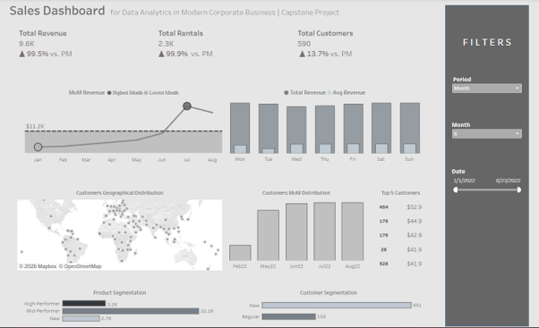
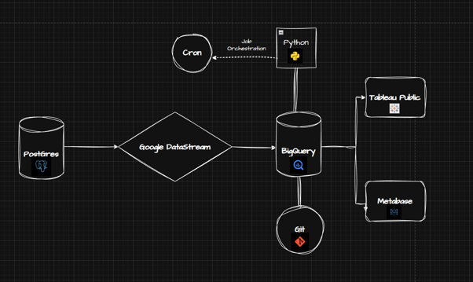

# Pagila End-to-End Analytics Pipeline

> **CDC-based analytics pipeline on Google Cloud — from an operational PostgreSQL database to executive dashboards in Tableau and Metabase.**

## 🟢 Live Interactive Dashboard

Click below to open the fully interactive dashboard — explore revenue trends, top customers, weekday patterns, and unique customer views, filter by period, hover over charts, and drill into the data.

[](https://roxannekyr.github.io/pagila-analytics-pipeline/)

> Hosted via GitHub Pages · Powered by Tableau Public

## Dashboard Overview

[](https://roxanikyritsi.github.io/pagila-analytics-pipeline/)
---

## Project Overview

This project simulates a real-world analytics-engineering workflow for a fictional DVD-rental business (using the open-source **Pagila** PostgreSQL dataset). It implements a production-style pipeline that:

1. **Replicates** an operational PostgreSQL database into a BigQuery data warehouse in near real-time using **Google Datastream (CDC)**.
2. **Transforms** the raw data into clean, queryable models following a **dbt-inspired staging → reporting layering**.
3. **Orchestrates** the Python ETL scripts via **cron** for repeatable scheduled runs.
4. **Surfaces** insights to business users through **Tableau Public** and **Metabase** dashboards.

The goal: demonstrate the full analytics engineering lifecycle — ingestion, modeling, orchestration, visualization, version control — on the same toolchain used by mid-to-large data teams in industry.

---

## Architecture



| Stage | Tool | Purpose |
|---|---|---|
| **Source** | PostgreSQL (Pagila) | Operational transactional database |
| **Replication** | Google Datastream | CDC streaming into BigQuery |
| **Data Warehouse** | Google BigQuery | Serverless cloud DWH |
| **Transformation** | Python (Jupyter → `.py`) | Staging + reporting models |
| **Orchestration** | Cron | Scheduled ETL execution |
| **Version Control** | Git + GitHub | Code review & collaboration |
| **BI / Viz** | Tableau Public & Metabase | Self-serve analytics |

---

## 📊 Dashboards

### Tableau Public Dashboard
Interactive dashboard with date-period filters, revenue trend lines, weekday-average bars, top-N customer tables, and unique-customer monthly bars.

🔗 **[Open in Tableau Public](https://public.tableau.com/app/profile/roxani.kyritsi/viz/DAMC_Dashboard_rk2/Dashboard?publish=yes)**

### Metabase
Metabase runs locally via Docker and connects directly to BigQuery using a GCP service-account key. Each business question is answered as a standalone Metabase question.


---

## 🗂️ Repository Structure

```
pagila-analytics-pipeline/
├── scripts/
│   ├── staging/                         # 15 .py scripts — one per source table
│   │   ├── stg_actor.py
│   │   ├── stg_address.py
│   │   ├── stg_category.py
│   │   ├── stg_city.py
│   │   ├── stg_country.py
│   │   ├── stg_customer.py
│   │   ├── stg_film.py
│   │   ├── stg_film_actor.py
│   │   ├── stg_film_category.py
│   │   ├── stg_inventory.py
│   │   ├── stg_language.py
│   │   ├── stg_payment.py
│   │   ├── stg_rental.py
│   │   ├── stg_staff.py
│   │   └── stg_store.py
│   └── reporting/                       # Aggregated reporting marts
│       ├── rep_revenue_per_period.py
│       ├──  rep_revenue_per_customer_and_period.py
        ├──  rep_rentals_per_customer_and_period.py
        ├──  rep_rentals_per_period.py
        ├── rep_customers_ordered.py
        ├── rep_films_rented.py
        └──rep_rental_details.py
├── job-orchestration/                   # Shell scripts + cron expressions
│   └── run_staging.sh
├── damc/visualizations/                 # Tableau workbook + Metabase exports
├── documents/                           # Architecture diagrams & references
├── requirements.txt
└── README.md
```

---

## 🧱 Methodology — Layered Data Modeling

Inspired by **dbt's recommended project structure**, the warehouse is organized into two clean layers (the intermediate layer is intentionally omitted to keep the scope focused):

**Staging layer (`staging_db`)** — One-to-one with the source. Standardizes column names (e.g., `name` → `category_name`), applies prefixes for clarity, and casts data types. **No business logic.** Each staging script is independently runnable and idempotent.

**Reporting layer (`reporting_db`)** — Business-ready marts.

- `rep_revenue_per_period` covers `Day`, `Month`, `Year` grain from 2015 onward, includes zero-revenue periods (gaps closed via an `all_dates` calendar), and excludes the non-billed film *GOODFELLAS SALUTE*.
- `rep_revenue_per_customer_and_period` provides per-customer revenue at `Day`, `Month`, and `Year` grain — only for dates with actual revenue, same exclusion applied.

This separation makes it trivial to (a) debug a single source independently, (b) reuse staging tables across multiple reporting models, and (c) hand the reporting layer to BI tools without exposing raw warehouse complexity.

---

## Reproducing the Pipeline

### Prerequisites
- A Google Cloud project with **BigQuery** and **Datastream** APIs enabled
- A service account with `BigQuery Data Editor` + `BigQuery Job User` roles (JSON key)
- Python 3.10+
- Access to the Pagila PostgreSQL instance (or a local clone)

### 1. Configure CDC replication
Run, then immediately start the Datastream private connection:
```sql
SELECT pg_create_logical_replication_slot('student_replication', 'pgoutput');
```

### 2. Install Python dependencies
```bash
pip install -r requirements.txt
export GOOGLE_APPLICATION_CREDENTIALS="/path/to/service-account.json"
```

### 3. Build the warehouse
```bash
# Staging layer
for f in scripts/staging/*.py; do python "$f"; done

# Reporting marts
python scripts/reporting/rep_revenue_per_period.py
python scripts/reporting/rep_revenue_per_customer_and_period.py
python scripts/reporting/rep_rentals_per_customer_and_period.py
python scripts/reporting/rep_rentals_per_period.py
python scripts/reporting/rep_customers_ordered.py
python scripts/reporting/rep_films_rented.py
python scripts/reporting/rep_rental_details.py
```

### 4. Schedule with cron
```bash
chmod +x job-orchestration/run_staging.sh
crontab -e
# Example: run daily at 02:30
30 2 * * * /absolute/path/to/job-orchestration/run_staging.sh >> /tmp/pipeline.log 2>&1
```

### 5. Connect Metabase via Docker
```bash
docker run -d -p 3000:3000 --name metabase metabase/metabase
# Open http://localhost:3000 and connect using the GCP service-account JSON
```

---
---

## Next Steps — Extended BI Visualizations

Plan is to deepen the dashboard layer by exposing the full richness of the reporting marts currently underutilized in BI tools.

**Rentals analysis** — Build views on top of `rep_rentals_per_period` and `rep_rentals_per_customer_and_period` to visualize rental volume trends alongside revenue, surfacing demand patterns independent of payment amounts.

**Film performance** — Use `rep_films_rented` to rank titles by rental frequency, cross-referenced with category from the staging layer, enabling genre-level performance breakdowns.

**Customer segmentation** — Combine `rep_customers_ordered` with per-customer revenue and rental marts to build RFM-style (Recency, Frequency, Monetary) views and identify high-value vs. churned customers.

**Rental detail drillthrough** — Expose `rep_rental_details` as a drillthrough layer in Tableau so high-level trends can be investigated at the individual transaction level without leaving the dashboard.

**Cross-mart blending** — Join revenue and rental marts to compute derived KPIs like revenue-per-rental and average rental duration per customer segment, currently not surfaced anywhere.

The staging layer is already clean and reusable, so these additions are purely a reporting and visualization effort with no upstream changes needed.

---

<sub>Built with PostgreSQL · Google Datastream · BigQuery · Python · Tableau · Metabase · Git </sub>


## 📚 Project Management

Detailed course notes:
- [Notion workspace — Pagila End-to-End Analytics Pipeline](https://www.notion.so/Pagila-End-to-End-Analytics-Pipeline-35cb6b0cb59080aeba2ae04c4283b6f8)

This project was developed as the capstone for the **Data Analytics in Modern Corporate Business** programme at the **International Hellenic University**.

---

<sub>Built with PostgreSQL · Google Datastream · BigQuery · Python · Tableau · Metabase · Git </sub>
